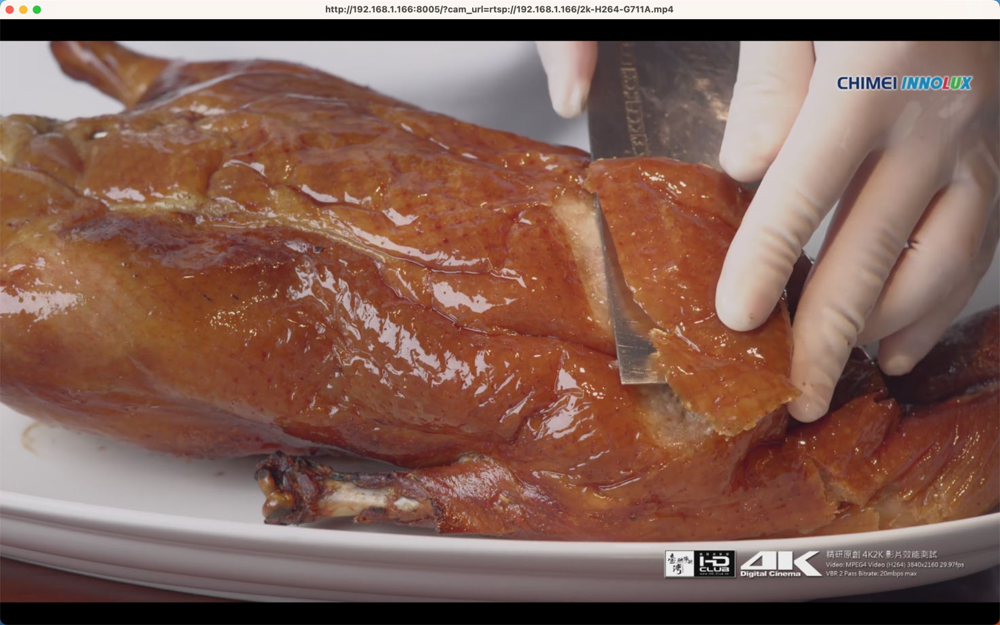
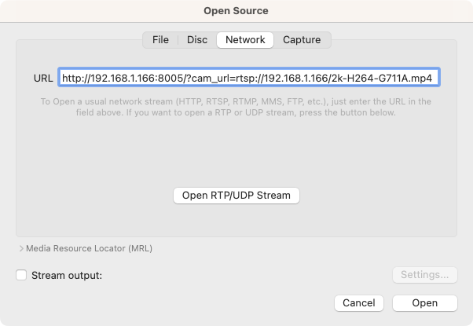
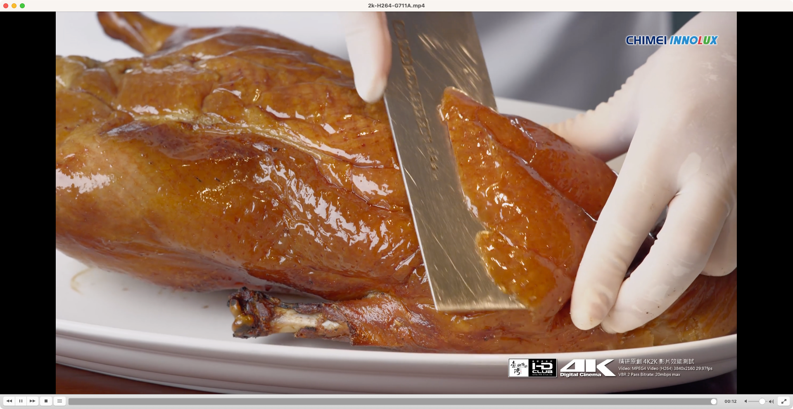
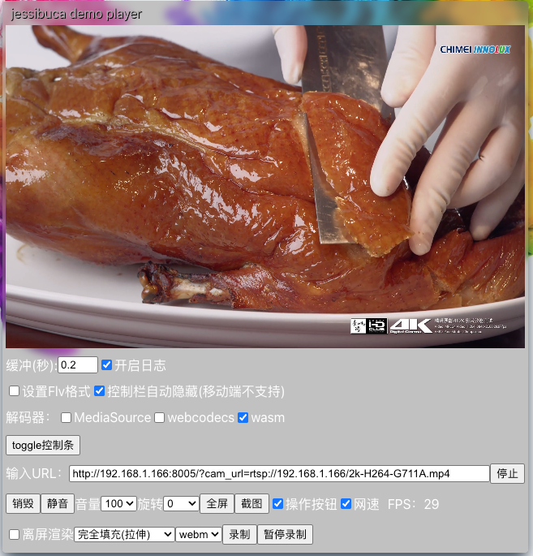
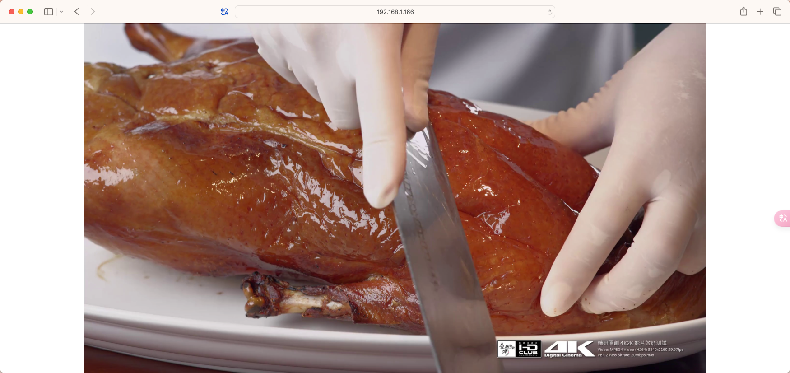
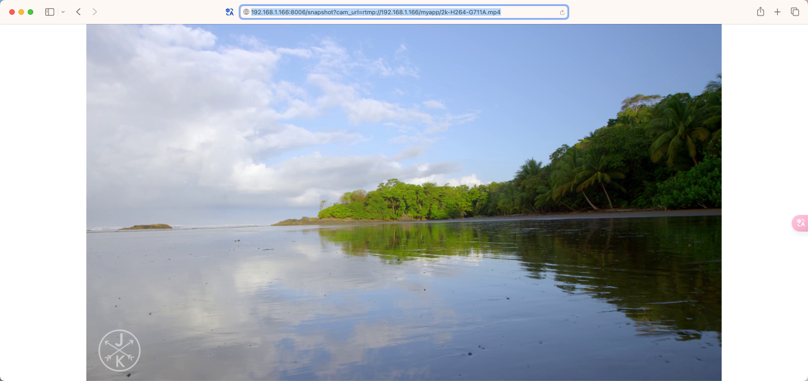

# CAM-HTTPFLV


CAM-HTTPFLV provides two core features:
- Convert various RTSP and RTMP video streams to HTTP-FLV live streams (playable in modern browsers)
- Capture snapshots from RTSP or RTMP streams and return them as JPG images

This documentation briefly introduces supported video formats, core functionalities, and how to use CAM-HTTPFLV.

## Table of Contents
- CAM-HTTPFLV
  - [Introduction](#introduction)
  - [Supported Video Formats](#supported-video-formats)
  - [Installation](#installation)
    - [Install via Docker (Recommended)](#install-via-docker-recommended)
    - [Install from Source](#install-from-source)
  - [Start Sample RTSP/RTMP Streams](#start-sample-rtsp-rtmp-streams)
    - [Live Streaming via HTTP-FLV](#live-streaming-via-http-flv)
    - [Snapshot Capture](#snapshot-capture)
      - [RTSP Snapshot Example](#rtsp-snapshot-example)
      - [RTMP Snapshot Example](#rtmp-snapshot-example)

## Introduction

In projects involving video structuring, smart surveillance, and smart cities, it’s often necessary to access camera streams in real time. However, RTSP and RTMP streams are not natively supported in web browsers.

In China, HTTP-FLV has become a widely adopted standard for low-latency live streaming across major platforms such as Douyin, Kuaishou, and Douyu.

To address the browser compatibility issues with RTSP/RTMP while staying within the HTTP-FLV ecosystem, we developed CAM-HTTPFLV.

## Supported Video Formats

The following formats have been tested and verified for compatibility:

| Input Protocol | Video Codec | Resolution         | Audio Codec | Output Protocol | Output Video Codec | Output Audio Codec |
|----------------|-------------|--------------------|-------------|------------------|---------------------|---------------------|
| RTSP           | h264        | 720p/1080p/2k/4k   | G711A       | HTTP-FLV         | h264                | AAC                 |
| RTSP           | h264        | 720p/1080p/2k/4k   | AAC         | HTTP-FLV         | h264                | AAC                 |
| RTSP           | h264        | 720p/1080p/2k/4k   | G711U       | HTTP-FLV         | h264                | AAC                 |
| RTSP           | h264        | 720p/1080p/2k/4k   | G722        | HTTP-FLV         | h264                | AAC                 |
| RTSP           | h264        | 720p/1080p/2k/4k   | G726        | HTTP-FLV         | h264                | AAC                 |
| RTSP           | h264        | 720p/1080p/2k/4k   | OPUS        | HTTP-FLV         | h264                | AAC                 |
| RTSP           | hevc        | 720p/1080p/2k/4k   | G711A       | HTTP-FLV         | hevc                | AAC                 |
| RTSP           | hevc        | 720p/1080p/2k/4k   | AAC         | HTTP-FLV         | hevc                | AAC                 |
| RTSP           | hevc        | 720p/1080p/2k/4k   | G711U       | HTTP-FLV         | hevc                | AAC                 |
| RTSP           | hevc        | 720p/1080p/2k/4k   | G722        | HTTP-FLV         | hevc                | AAC                 |
| RTSP           | hevc        | 720p/1080p/2k/4k   | G726        | HTTP-FLV         | hevc                | AAC                 |
| RTSP           | hevc        | 720p/1080p/2k/4k   | OPUS        | HTTP-FLV         | hevc                | AAC                 |
| RTMP           | h264        | 720p/1080p/2k/4k   | G711A       | HTTP-FLV         | h264                | AAC                 |
| RTMP           | h264        | 720p/1080p/2k/4k   | AAC         | HTTP-FLV         | h264                | AAC                 |
| RTMP           | h264        | 720p/1080p/2k/4k   | G711U       | HTTP-FLV         | h264                | AAC                 |

## Installation

Ensure TCP ports 8005 and 8006 are available before installation:
- Port 8005 is used for HTTP-FLV live streaming
- Port 8006 is used for snapshot capture

Assume your server IP is `192.168.1.166`.

### Install via Docker (Recommended)

```bash
docker run -itd -p 8005:8005 -p 8006:8006 \
 --restart=always --name=cam-httpflv \
 zhoukunpeng505/cam-httpflv:latest
```

### Install from Source

Ensure your Python version is >= 3.9.x.

```bash
git clone git@github.com:zhoukunpeng504/CAM-HTTPFLV.git
cd CAM-HTTPFLV
pip3 install -r requirements.txt
python3 server.py
```

### Feature 1: Convert Video Stream to HTTP-FLV

URL format:
```
http://192.168.1.166:8005/?cam_url=XX
```
- Replace `XX` with your video stream URL, e.g.,  
  `rtsp://192.168.1.166/720p-H264-AAC.mp4`  
  or  
  `rtmp://192.168.1.166/myapp/720p-H264-AAC.mp4`

Supported players: VLC, ffplay (from ffmpeg), jessibuca, flv.js

### Feature 2: Snapshot from Live Stream

URL format:
```
http://192.168.1.166:8006/snapshot?cam_url=XX
```
- Replace `XX` with the stream URL.

Send a GET request to retrieve the current snapshot in JPG format.

## Start Sample RTSP/RTMP Streams

We provide test servers for both RTSP and RTMP formats. Ensure the following ports are available:
- TCP 554
- UDP 554
- TCP 1935

Launch test streams:

```bash
git clone git@github.com:zhoukunpeng504/CAM-HTTPFLV.git
cd CAM-HTTPFLV/testdir
unzip happytime-rtsp-server.zip
unzip happytime-rtmp-server.zip

# Start RTSP server
cd happytime-rtsp-server
./start.sh

# Start RTMP server
cd ../happytime-rtmp-server
./start.sh
```

See the full list of test video stream URLs in the original documentation.

## Live Streaming via HTTP-FLV

Using sample RTSP stream:
```
rtsp://192.168.1.166/2k-H264-G711A.mp4
```

### 1. Play with ffplay
```bash
ffplay -i 'http://192.168.1.166:8005/?cam_url=rtsp://192.168.1.166/2k-H264-G711A.mp4'
```



### 2. Play with VLC

Open VLC > File > Open Network  
Enter the following URL:
```bash
http://192.168.1.166:8005/?cam_url=rtsp://192.168.1.166/2k-H264-G711A.mp4
```



Click "Open" to begin streaming.



### 3. Play with Jessibuca

Visit [Jessibuca Player](http://jessibuca.monibuca.com/player.html)

Enter the stream URL and click play:
```bash
http://192.168.1.166:8005/?cam_url=rtsp://192.168.1.166/2k-H264-G711A.mp4
```



## Snapshot Capture

### RTSP Snapshot Example

Stream URL:
```
rtsp://192.168.1.166/2k-H264-G711A.mp4
```

Snapshot URL:
```
http://192.168.1.166:8006/snapshot?cam_url=rtsp://192.168.1.166/2k-H264-G711A.mp4
```

Preview:



### RTMP Snapshot Example

Stream URL:
```
rtmp://192.168.1.166/myapp/2k-H264-G711A.mp4
```

Snapshot URL:
```
http://192.168.1.166:8006/snapshot?cam_url=rtmp://192.168.1.166/myapp/2k-H264-G711A.mp4
```

Preview:


