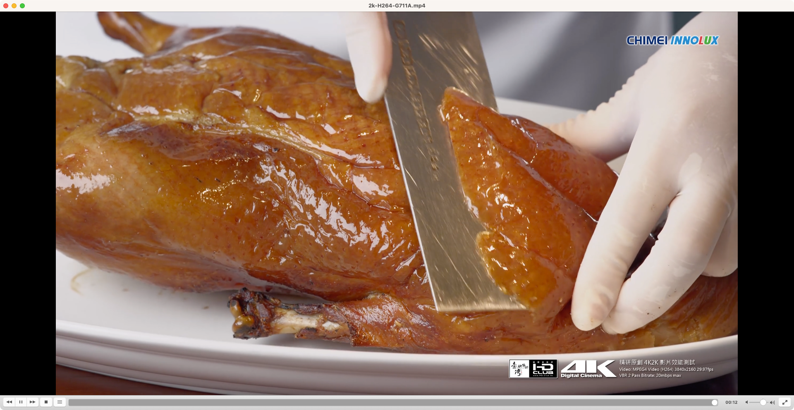

# CAM-HTTPFLV


CAM-HTTPFLV 支持两大核心功能：
- 把各种格式的RTSP、RTMP视频流转化为HTTPFLV格式的直播视频流(可支持在各种浏览器中访问)
- 对各种格式的RTSP、RTMP视频流进行在线快照，返回jpg格式的图像

在这里，我们简要介绍下CAM-HTTPFLV的支持的视频格式、主要功能以及如何使用。
## 内容
- CAM-HTTPFLV
  - [介绍](#介绍)
  - [支持的视频格式](#支持的视频格式)
  - [如何安装](#如何安装)
    - [使用docker安装(推荐)](#使用docker安装推荐)
    - [使用源码安装](#使用源码安装)
  - [启动测试视频源](#准备rtsp及rtmp测试视频流)
    - [视频源转HTTPFLV直播流](#视频源转httpflv直播流)
    - [视频源实时快照](#视频源实时快照)
      - [RTSP实时快照](#rtsp实时快照测试)
      - [RTMP实时快照](#rtmp实时快照测试)

## 介绍
在视频结构化、智能安防、智慧城市等项目中需要频繁对摄像机进行在线访问，
然而摄像机内置的RTSP、RTMP视频流均无法直接在浏览器中访问。
目前，在中国基于HTTPFLV协议的视频直播正在各大平台广泛使用。(如：抖音直播、快手直播、斗鱼直播等)
为了解决现有RTSP、RTMP协议在web浏览器中难以访问的困境，并保持HTTPFLV协议的兼容，
我们开发了CAM-HTTPFLV项目。

## 支持的视频格式
如下格式已经经过兼容性测试。


| 视频源格式 | 视频编码 | 分辨率           | 音频编码 | 输出格式 | 输出视频编码 | 输出音频编码 |
| ---------- | -------- | ---------------- | -------- | -------- | ------------ | ------------ |
| RTSP       | h264     | 720p/1080p/2k/4k | G711A    | HTTP-FLV | h264         | AAC          |
| RTSP       | h264     | 720p/1080p/2k/4k | AAC      | HTTP-FLV | h264         | AAC          |
| RTSP       | h264     | 720p/1080p/2k/4k | G711U    | HTTP-FLV | h264         | AAC          |
| RTSP       | h264     | 720p/1080p/2k/4k | G722     | HTTP-FLV | h264         | AAC          |
| RTSP       | h264     | 720p/1080p/2k/4k | G726     | HTTP-FLV | h264         | AAC          |
| RTSP       | h264     | 720p/1080p/2k/4k | OPUS     | HTTP-FLV | h264         | AAC          |
| RTSP       | hevc     | 720p/1080p/2k/4k | G711A    | HTTP-FLV | hevc         | AAC          |
| RTSP       | hevc     | 720p/1080p/2k/4k | AAC      | HTTP-FLV | hevc         | AAC          |
| RTSP       | hevc     | 720p/1080p/2k/4k | G711U    | HTTP-FLV | hevc         | AAC          |
| RTSP       | hevc     | 720p/1080p/2k/4k | G722     | HTTP-FLV | hevc         | AAC          |
| RTSP       | hevc     | 720p/1080p/2k/4k | G726     | HTTP-FLV | hevc         | AAC          |
| RTSP       | hevc     | 720p/1080p/2k/4k | OPUS     | HTTP-FLV | hevc         | AAC          |
| RTMP       | h264     | 720p/1080p/2k/4k | G711A    | HTTP-FLV | h264         | AAC          |
| RTMP       | h264     | 720p/1080p/2k/4k | AAC      | HTTP-FLV | h264         | AAC          |
| RTMP       | h264     | 720p/1080p/2k/4k | G711U    | HTTP-FLV | h264         | AAC          |


## 如何安装

安装前需保证TCP:8005、TCP:8006端口可用(其中8005端口用于HTTPFLV流媒体，8006端口用于对视频源进行快照)。
在这里假设服务器IP为 192.168.1.166。
### 使用docker安装(推荐)
```bash
docker run -itd -p 8005:8005 -p 8006:8006  \
 --restart=always --name=cam-httpflv  \
 zhoukunpeng505/cam-httpflv:latest
```

### 使用源码安装
安装前确保python版本>=3.9.x
```bash
git clone git@github.com:zhoukunpeng504/CAM-HTTPFLV.git
cd  CAM-HTTPFLV
pip3 install -r requirements.txt
python3 server.py
```
### 功能1：视频源转HTTPFLV直播流
URL:http://192.168.1.166:8005/cam_url=XX
- XX: 视频源URL。如:rtsp://192.168.1.166/720p-H264-AAC.mp4、rtmp://192.168.1.166/myapp/720p-H264-AAC.mp4

如何使用？
1. 根据使用场景，拼接url，如：视频源地址为rtmp://192.168.1.166/myapp/720p-H264-AAC.mp4，则转换后的HTTPFLV视频流地址为：
http://192.168.1.166:8005/cam_url=rtmp://192.168.1.166/myapp/720p-H264-AAC.mp4
2. 将地址填入播放器中，开始播放。目前支持的播放器：VLC、ffplay(ffmpeg)、jessibuca、flv.js


### 功能2：视频源实时快照
URL:http://192.168.1.166:8006/snapshot?cam_url=XX
- XX: 视频源URL。如:rtsp://192.168.1.166/720p-H264-AAC.mp4、rtmp://192.168.1.166/myapp/720p-H264-AAC.mp4
如何使用？
通过GET请求向该地址发起请求即可得到视频源当前的快照图片，格式为jpg。


## 准备RTSP及RTMP测试视频流
我们提供了RTSP server测试程序和RTMP server测试程序。 
需提前保证TCP554 、UDP554、TCP1935 端口可用。
可通过如下方式启动：
```bash
git clone git@github.com:zhoukunpeng504/CAM-HTTPFLV.git
cd CAM-HTTPFLV/testdir
unzip happytime-rtsp-server.zip
unzip happytime-rtmp-server.zip
# 启动RTSP server
cd happytime-rtsp-server
./start.sh
# 启动RTMP server
cd ..
cd happytime-rtmp-server
./start.sh
```
假设当前服务器IP为 192.168.1.166 那么所有的RTSP测试视频流如下：
- rtsp://192.168.1.166/720p-H264-AAC.mp4 分辨率720p,视频编码H264,音频编码AAC
- rtsp://192.168.1.166/720p-H264-G711A.mp4 分辨率720p,视频编码H264,音频编码G711A
- rtsp://192.168.1.166/720p-H264-G711U.mp4 分辨率720p,视频编码H264,音频编码G711U
- rtsp://192.168.1.166/720p-H264-G722.mp4 分辨率720p,视频编码H264,音频编码G722
- rtsp://192.168.1.166/720p-H264-G726.mp4 分辨率720p,视频编码H264,音频编码G726
- rtsp://192.168.1.166/720p-H264-OPUS.mp4 分辨率720p,视频编码H264,音频编码OPUS
- rtsp://192.168.1.166/720p-H265-AAC.mp4 分辨率720p,视频编码H265,音频编码AAC
- rtsp://192.168.1.166/720p-H265-G711A.mp4 分辨率720p,视频编码H265,音频编码G711A
- rtsp://192.168.1.166/720p-H265-G711U.mp4 分辨率720p,视频编码H265,音频编码G711U
- rtsp://192.168.1.166/720p-H265-G722.mp4 分辨率720p,视频编码H265,音频编码G722
- rtsp://192.168.1.166/720p-H265-G726.mp4 分辨率720p,视频编码H265,音频编码G726
- rtsp://192.168.1.166/720p-H265-OPUS.mp4 分辨率720p,视频编码H265,音频编码OPUS
- rtsp://192.168.1.166/1080p-H264-AAC.mp4 分辨率1080p,视频编码H264,音频编码AAC
- rtsp://192.168.1.166/1080p-H264-G711A.mp4 分辨率1080p,视频编码H264,音频编码G711A
- rtsp://192.168.1.166/1080p-H264-G711U.mp4 分辨率1080p,视频编码H264,音频编码G711U
- rtsp://192.168.1.166/1080p-H264-G722.mp4 分辨率1080p,视频编码H264,音频编码G722
- rtsp://192.168.1.166/1080p-H264-G726.mp4 分辨率1080p,视频编码H264,音频编码G726
- rtsp://192.168.1.166/1080p-H264-OPUS.mp4 分辨率1080p,视频编码H264,音频编码OPUS
- rtsp://192.168.1.166/1080p-H265-AAC.mp4 分辨率1080p,视频编码H265,音频编码AAC
- rtsp://192.168.1.166/1080p-H265-G711A.mp4 分辨率1080p,视频编码H265,音频编码G711A
- rtsp://192.168.1.166/1080p-H265-G711U.mp4 分辨率1080p,视频编码H265,音频编码G711U
- rtsp://192.168.1.166/1080p-H265-G722.mp4 分辨率1080p,视频编码H265,音频编码G722
- rtsp://192.168.1.166/1080p-H265-G726.mp4 分辨率1080p,视频编码H265,音频编码G726
- rtsp://192.168.1.166/1080p-H265-OPUS.mp4 分辨率1080p,视频编码H265,音频编码OPUS
- rtsp://192.168.1.166/2k-H264-AAC.mp4 分辨率2k,视频编码H264,音频编码AAC
- rtsp://192.168.1.166/2k-H264-G711A.mp4 分辨率2k,视频编码H264,音频编码G711A
- rtsp://192.168.1.166/2k-H264-G711U.mp4 分辨率2k,视频编码H264,音频编码G711U
- rtsp://192.168.1.166/2k-H264-G722.mp4 分辨率2k,视频编码H264,音频编码G722
- rtsp://192.168.1.166/2k-H264-G726.mp4 分辨率2k,视频编码H264,音频编码G726
- rtsp://192.168.1.166/2k-H264-OPUS.mp4 分辨率2k,视频编码H264,音频编码OPUS
- rtsp://192.168.1.166/2k-H265-AAC.mp4 分辨率2k,视频编码H265,音频编码AAC
- rtsp://192.168.1.166/2k-H265-G711A.mp4 分辨率2k,视频编码H265,音频编码G711A
- rtsp://192.168.1.166/2k-H265-G711U.mp4 分辨率2k,视频编码H265,音频编码G711U
- rtsp://192.168.1.166/2k-H265-G722.mp4 分辨率2k,视频编码H265,音频编码G722
- rtsp://192.168.1.166/2k-H265-G726.mp4 分辨率2k,视频编码H265,音频编码G726
- rtsp://192.168.1.166/2k-H265-OPUS.mp4 分辨率2k,视频编码H265,音频编码OPUS
- rtsp://192.168.1.166/4k-H264-AAC.mp4 分辨率4k,视频编码H264,音频编码AAC
- rtsp://192.168.1.166/4k-H264-G711A.mp4 分辨率4k,视频编码H264,音频编码G711A
- rtsp://192.168.1.166/4k-H264-G711U.mp4 分辨率4k,视频编码H264,音频编码G711U
- rtsp://192.168.1.166/4k-H264-G722.mp4 分辨率4k,视频编码H264,音频编码G722
- rtsp://192.168.1.166/4k-H264-G726.mp4 分辨率4k,视频编码H264,音频编码G726
- rtsp://192.168.1.166/4k-H264-OPUS.mp4 分辨率4k,视频编码H264,音频编码OPUS
- rtsp://192.168.1.166/4k-H265-AAC.mp4 分辨率4k,视频编码H265,音频编码AAC
- rtsp://192.168.1.166/4k-H265-G711A.mp4 分辨率4k,视频编码H265,音频编码G711A
- rtsp://192.168.1.166/4k-H265-G711U.mp4 分辨率4k,视频编码H265,音频编码G711U
- rtsp://192.168.1.166/4k-H265-G722.mp4 分辨率4k,视频编码H265,音频编码G722
- rtsp://192.168.1.166/4k-H265-G726.mp4 分辨率4k,视频编码H265,音频编码G726
- rtsp://192.168.1.166/4k-H265-OPUS.mp4 分辨率4k,视频编码H265,音频编码OPUS
所有的RTMP测试视频流如下：
- rtmp://192.168.1.166/myapp/720p-H264-AAC.mp4 分辨率720p,视频编码H264,音频编码AAC
- rtmp://192.168.1.166/myapp/720p-H264-G711A.mp4 分辨率720p,视频编码H264,音频编码G711A
- rtmp://192.168.1.166/myapp/720p-H264-G711U.mp4 分辨率720p,视频编码H264,音频编码G711U
- rtmp://192.168.1.166/myapp/1080p-H264-AAC.mp4 分辨率1080p,视频编码H264,音频编码AAC
- rtmp://192.168.1.166/myapp/1080p-H264-G711A.mp4 分辨率1080p,视频编码H264,音频编码G711A
- rtmp://192.168.1.166/myapp/1080p-H264-G711U.mp4 分辨率1080p,视频编码H264,音频编码G711U
- rtmp://192.168.1.166/myapp/2k-H264-AAC.mp4 分辨率2k,视频编码H264,音频编码AAC
- rtmp://192.168.1.166/myapp/2k-H264-G711A.mp4 分辨率2k,视频编码H264,音频编码G711A
- rtmp://192.168.1.166/myapp/2k-H264-G711U.mp4 分辨率2k,视频编码H264,音频编码G711U
- rtmp://192.168.1.166/myapp/4k-H264-AAC.mp4 分辨率4k,视频编码H264,音频编码AAC
- rtmp://192.168.1.166/myapp/4k-H264-G711A.mp4 分辨率4k,视频编码H264,音频编码G711A
- rtmp://192.168.1.166/myapp/4k-H264-G711U.mp4 分辨率4k,视频编码H264,音频编码G711U

## 视频源转HTTPFLV直播流
如下以rtsp://192.168.1.166/2k-H264-G711A.mp4为视频源。
在实际应用中选取rtsp、rtmp协议的视频源均可。
1. 使用ffplay 播放
```bash
ffplay -i 'http://192.168.1.166:8005/?cam_url=rtsp://192.168.1.166/2k-H264-G711A.mp4'
```


2. 使用vlc播放
在VLC菜单项中依次点击--File--Open Network
将如下的链接填入输出框：
```bash
http://192.168.1.166:8005/?cam_url=rtsp://192.168.1.166/2k-H264-G711A.mp4
```


然后点击Open




3.使用jessibuca播放
打开如下链接：[jessibuda测试地址](http://jessibuca.monibuca.com/player.html)
在网页中填入播放地址，并点击播放：
```bash
http://192.168.1.166:8005/?cam_url=rtsp://192.168.1.166/2k-H264-G711A.mp4
```


## 视频源实时快照

### RTSP实时快照测试
测试视频源地址是：rtsp://192.168.1.166/2k-H264-G711A.mp4
实时快照地址为：
http://192.168.1.166:8006/snapshot?cam_url=rtsp://192.168.1.166/2k-H264-G711A.mp4


效果预览：


### RTMP实时快照测试
测试视频源地址是：rtsp://192.168.1.166/myapp/2k-H264-G711A.mp4
实时快照地址为：
http://192.168.1.166:8006/snapshot?cam_url=rtmp://192.168.1.166/myapp/2k-H264-G711A.mp4


效果预览：


